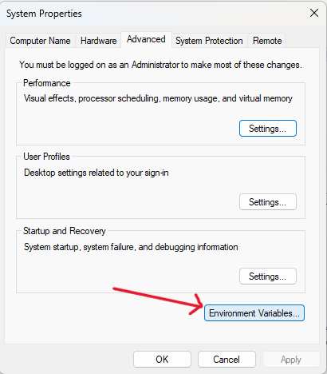
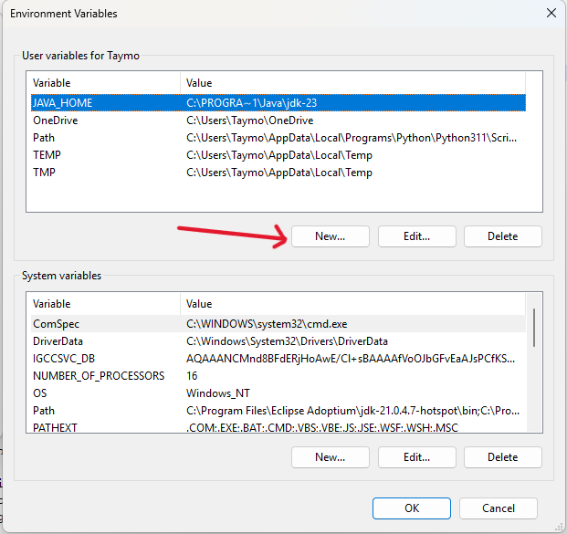
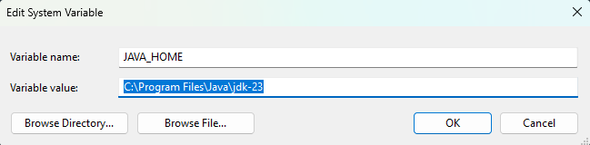

# Purpose:

The purpose of this repo is to test and evaluate the embedded feature annotations plugin
[HAnS-LSp](https://github.com/isselab/HAnS-LSP/tree/test-with-plugin) for Visual Studio Code.

### Requirements:

- Visual Studio code installed
- Required JDK 22+
- Installed HAnS-LSP-vscode plugin
- JAVA_Home Set to JDK 22+
- Make sure you turn on auto-save in Visual studio code or save your changes after every step for the extension to work correctly.

### JAVA HOME SETTINGS

How to set JAVA_HOME on windows:

Search for 'Edit the system environment variables'\

click on 'Environment Variables'\

click 'new...' to create a new variable.\

Name the Variable 'JAVA_HOME' and add the path to your JDK 22+ as the value\

### Installation of the HAnS-LSP plugin:

- Open Viusual studio Code -> Extensions (ctrl shift x) -> three points (Views and more actions)"

  

- Choose the path to the VSIX file of the plugin after unzipping the downloaded Userstudy.zip.

### Visual Studio auto-save

-auto save would save tthe effort of pressing save after every change :)

### How to disable the extension

1. To temporarily disable the HAnS-LSP extension -> go to extensions -> search for HAnS-LSP -> click the gear button at the right of an extension entry.

2. Click "Disable".

3. Click "restart extensions"

## The Snake

A simple snake game in java, forked from [@hexadeciman](https://github.com/hexadeciman/Snake), using Threads and Java
Swing to display the game.

### How it looks:

### How it works:

The aim of the game is to make the snake grow as big as possible by moving across the playing area and eating food.
The snake is controlled with the arrow keys of your keyboard. No walls are present in the game so when the snake
crosses the edge of the playing area it appears at the opposite side. Food is represented by blue squares that
increases the size of the snake by one square when eaten. After being eaten, the food respawns at a random location
not occupied by the snake. The game is finished only when the snake collides with itself in any way.

The playing area is represented by a grid of tiles where each tile has a color that signals what type of tile is
located there. The background of the game is filled with white tiles where the snake may move freely. The snake itself
is made up of grey tiles that move according to the directions given by the player. Food are blue tiles that have
logic to enlarge the snake by one and then respawn.

# Background

As software projects keeps getting bigger and bigger developers often find navigating the code to be a difficult task.
Using features is a common way to talk about code and the product, but it is often difficult to find the features
in code. The use of embedded feature annotations is a way to leave traces of where features are implemented.
That's HAnS has been created for Intellij users. Our mission is to create a Language server protocol to make HAnS IDE independent.

## Definition of a feature

> A feature is a characteristic or end-user-visible behaviour of a software system. Features are used in product-line
> engineering to specify and communicate commonalities and differences of the products between stakeholders, and to
> guide structure, reuse, and variation across all phases of the software life cycle. - Apel, Batory, Kästner, and Saake
> (2013)

The analogy to the snake game is for example the feature `Controls` which is the collective code and behaviour
concerned with pressing the arrow keys.

## Feature location

A large part of the work of a developer consists of finding the implementation of a feature in code. This is necessary
in order to extend, maintain and remove features, and it often requires substantial effort. This activity is known as
feature location. A definition of feature location reads:

> Feature location is the task of finding the source code in a system that implements a feature. - Krüger, Berger, et
> al. (2018)

## Embedded Feature Annotations

The usage of feature annotations is to map sections of code to functionality of the software. The intent is that this
can help developers with feature location. The system of annotations that the HAnS plugin uses is able to map features
to any file type and programming language (except languages that do not have support for comments). The central part of
this annotation system is a file with the extension `.feature-model`. This is a feature hierarchy model, describing
feature names, and their hierarchy in textual form. These are all the features present in the system, and they may then
be referenced by mapping them to code by using the annotations described below. The feature model is where you define a
feature. The feature model below is contains all features present in the Snake game.

## Feature child

in this example Playing_Area is a child of Snake_Game

### Feature Reference Names

Inside the feature hierarchy model, features with the same name may appear twice or more often. To reference
features uniquely the individual feature is pre-extended with its ancestor until the combined feature reference is
unique (separated by "::"). This technique is called Least-Partially-Qualified name, short LPQ. The feature `Snake`
is mentioned twice above and must therefore be referenced uniquely in the manner below.

### Feature-to-code mapping

The feature-to-code mapping serves to link specific blocks and lines of code to one or more features. The parts of the
source code which are mapped to a certain feature are called annotation scopes. An annotation scope is surrounded by
annotation markers and contains at least one feature reference. In the example below the feature `Move` is mapped to
the block encapsulated by the `&begin` and `&end` statements. The feature `Collision` is mapped to the single line
where it lies.

### Feature-to-file mapping

The feature-to-file mapping is a specialized file with the extension `.feature-to-file` and is used to map one or more
file(s) and its/their content to one or more features. All content of the linked file is considered fully to be part of
the given feature references. The mapping file must be stored in the same folder as the source code files and covers
only the file in this folder. In the example below each feature is mapped to the file listed above. Additional
mappings can be added beneath existing mappings in the file.

### Feature-to-folder mapping

The purpose of this file is to map complete folders and their content to one or more feature references. The mapping of
feature references to folders allows linking specific features to the folder, including all its sub-folders and files.
With this, the mapping of complete folder structures to features is possible and may substitute the feature-to-file
mapping. The mapping file is located on the top level inside the to be annotated folder. Let's say, for example, that
a feature relates to all code in a folder, then it could be mapped by writing the feature name in a file with the
extension `.feature-to-folder` as below. Features must be separated by either spaces or new lines.

## HAnS-LSP: Helping Annotate Software

The purpose of HAnS is to enable recording and editing support for feature annotations.

#### HAnS-LSP supports:

For the parsing to work properly, make sure to save your files after changes.

- Embedded Feature Annotations (check .feature-model to browse all defined features)

- Annotation Completion (ctrl space to get suggested completion)

- Hover over annotation (either hover over the feature name, or over the annotation marker, e.g. begin, end or line).
  hovering will give information about that feature.
  **please note: hovering is keeping the mouse on the word, no clicks needed**

- feature name suggestion (ctrl space to get suggested name)

the "Move" feature is already defined in the .feature-model file 

- Definition: while in a code file (e.g. Window.java), right click on the feature's name written between [...] -> Go to -> definition. this will show you where the feature has been defined
  (IMPORTANT: Calling Definition when in the ".feature-model" file results in VS Code calling the reference method instead)

- Reference: while in .feature-model file, right click on the feature name -> GO to -> reference. The user will then see where this feature has been annotated in the all files that belongs to the feature model.

## Study Group

- [Group 1](./guide/group1.md)
- [Group 2](./guide/group2.md)
