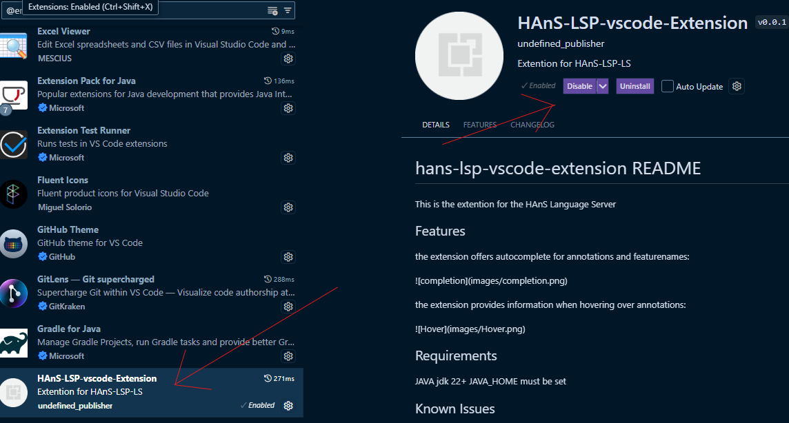

# Tasks to complete

During the task, take notes while coding, so you can answer the questionnaire after completing all the tasks.
Make sure you turn on auto-save in Visual Studio Code or save your changes after every step for the extension to work correctly.
*See the README file for clarification*

## First part: Annotating without HAnS-LSP

#### Disable the plugin.
1. To temporarily disable the HAnS-LSP extension -> go to extensions -> search for HAnS-LSP -> click the gear button at the right of an extension entry.
2. Click "Disable".

3. Click "restart extensions"

### Warmup task

Add a .feature-to-folder file in the graphics folder.
* Verify that the feature Playing_Area is defined in the .feature-model file. * 
Map the feature Playing_Area to the new .feature-to-folder file by writing it into that file.
* To know how to map a feature to a folder you can check again in the readme file *

You have now mapped the feature *Playing_Area* to the *graphics* directory.

### Task 1:

Implement a method 'changeGrowth(int x){...}' that changes the size, the snake grows by and annotate it as feature (choose a fitting name).
* Hint 1: the growth depends on the growth variable *
The method should be added to /src/logic/ThreadsController.java file.
The feature should be defined as a child feature of Snake in the Feature Model. 
 

**Reminder: Make sure you annotate the code you write!**

### Task 2:

Add a .feature-to-file file in the pojo folder.
* Verify that the feature "Tile" is defined in the .feature-model file. * 
Map the feature "Tile" to the file Tuple.java.
* To know how to map a feature to a file you can check again in the readme file *

### Task 3:

Add a new feature (Choose any name) to the .feature-model file, then annotate both functions, namely getWindowWidth() and getWindowHeight(), in a single block ( //&Begin[you feature's name] ... both functions logic....//&End[you feature's name] ).
These functions can be found in the /src/graphics/Window.java file.
* To know how to annotate a block of code you can check again in the readme file *

## Second part: Annotating with HAnS-LSP

#### Enable the plugin.
1. to enable the HAnS-LSP extension -> go to extensions -> search for HAnS-LSP -> click the gear button at the right of an extension entry.
2. Click "Enable".

### Warmup task

Add a `.feature-to-folder` file in the pojo folder.
* Verify that the feature "Tile" is defined in the .feature-model file. * 
Map the feature "DataTypes" to the new .feature-to-folder file by writing it into that file.
* To know how to map a feature to a folder you can check again in the readme file *

You have now mapped the feature *DataTypes* to the *pojo* directory.

### Task 4

Implement a method 'changeSpeed(long x){...}' that changes the speed of the snake and annotate it as feature (choose a fitting name).
* Hint 1: the speed is dependent on the game speed *
* Hint 2: gamespeed depends on the sleep time of the pause methode * 
* Hint 3: the pause time depends on the delay variable *
The method should be added to /src/logic/ThreadsController.java file.
The feature should be defined as a child feature of Snake in the Feature Model. 

**Reminder: Make sure you annotate the code you write!**

### Task 5

Add a `.feature-to-file` file in the logic folder.
* Verify that the feature "Controls" is defined in the .feature-model file. * 
Map the feature "Controls" to the file KeyboardListener.java.
* to know how to map a feature to a file you can check again in the readme file *

### Task 6

In the file /src/graphics/Window.java check all feature annotations. then go to .feature-model file and check if each feature is defined there. If a feature is not defined in the .feature-model file add it.

# Answer questions
After completing the tasks above, fill out the [survey](https://docs.google.com/forms/d/e/1FAIpQLSdcpbnTASBGH6cRMHw2DUJWOQm3MigtSJPRo37Q_eYchaOqZg/viewform?usp=sf_link).
