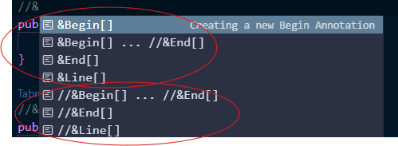
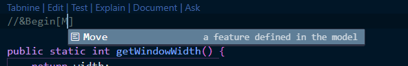
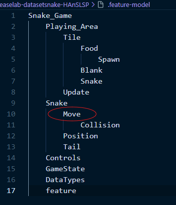
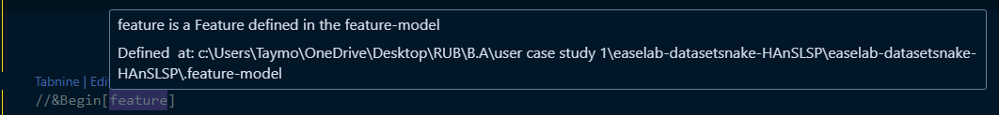
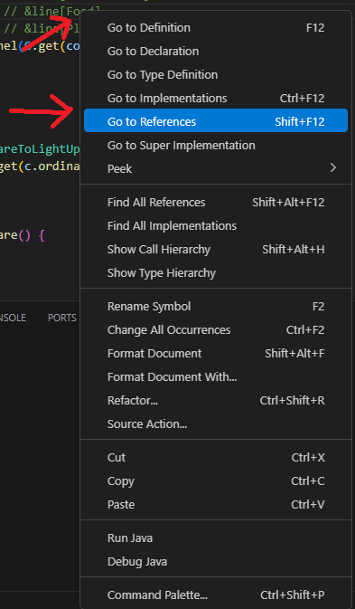

# hans-lsp-vscode-extension README

This is the extention for the HAnS Language Server

## Supported Features

For the parsing to work properly, make sure to save your files after changes.

- Annotation Completion (ctrl space to get suggested completion)

- feature name suggestion (ctrl space to get suggested name)

the suggested "Move" feature is already defined in the .feature-model file

- Hover over annotation (either hover over the feature name, or over the annotation marker, e.g. begin, end or line).
  hovering will give information about that feature.
  **please note: hovering is keeping the mouse on the word, no clicks needed**

- Definition: while in a code file (e.g. Window.java), right click on the feature's name written between [...] -> Go to -> definition. this will show you where the feature has been defined
  (IMPORTANT: Calling Definition when in the ".feature-model" file results in VS Code calling the reference method instead)

- Reference: while in .feature-model file, right click on the feature name -> GO to -> reference. The user will then see where this feature has been annotated in the all files that belongs to the feature model.

## Further Explanation

- Demo Video:

- the "Move" feature is already defined in the .feature-model file

## Requirements

JAVA jdk 22+
JAVA_HOME must be set

## Known Issues

## Release Notes

Users appreciate release notes as you update your extension.

### 1.0.0

Initial release of HAnS LSP extension
